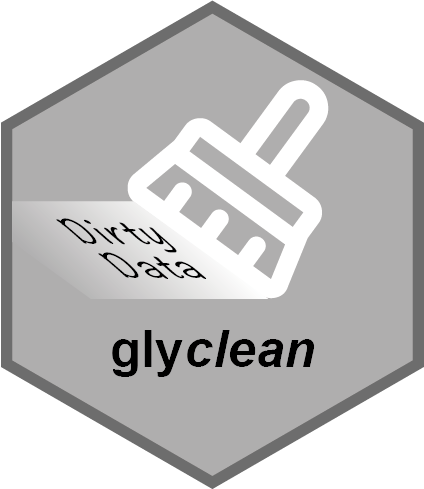

<!-- README.md is generated from README.Rmd. Please edit that file -->

# glyclean <a href="https://glycoverse.github.io/glyclean/"></a>

<!-- badges: start -->

[](https://lifecycle.r-lib.org/articles/stages.html#experimental)
[](https://CRAN.R-project.org/package=glyclean)
[](https://github.com/glycoverse/glyclean/actions/workflows/R-CMD-check.yaml)
[](https://app.codecov.io/gh/glycoverse/glyclean)
<!-- badges: end -->

Omics data cleaning and preprocessing is a critical yet cumbersome step.
**glyclean** helps you perform these tasks with ease, so you can focus
on the fun part: downstream analysis!

## Installation

You can install the development version of glyclean from
[GitHub](https://github.com/) with:

``` r
# install.packages("pak")
pak::pak("glycoverse/glyclean")
```

## Example

``` r
library(glyexp)
library(glyclean)
#> 
#> Attaching package: 'glyclean'
#> The following object is masked from 'package:stats':
#> 
#>     aggregate

exp <- toy_experiment()
exp <- set_exp_type(exp, "glycomics")
clean_exp <- auto_clean(exp)
```

Yes, that’s it! Calling the magical `auto_clean()` function will
automatically perform the following steps, in the most suitable way for
your data:

-   Normalization
-   Missing value filtering
-   Imputation
-   Batch effect correction

and other steps that are necessary for downstream analysis.
