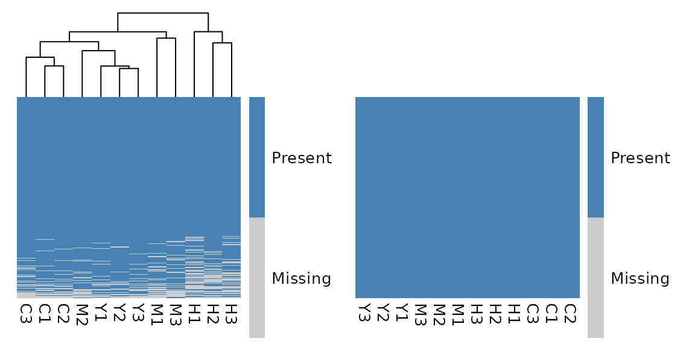

# Get Started with glyclean

## Welcome to the Wild World of Data Preprocessing! 🧬

Every omics data analysis journey begins with the same challenge: taming
your raw data. Think of it like preparing ingredients before cooking a
gourmet meal – you need to wash, chop, and season everything just right.
In the glycomics and glycoproteomics world, this means normalization,
missing value handling, and batch effect correction.

Meet `glyclean` – your Swiss Army knife for glycoproteomics and
glycomics data preprocessing! This package provides a comprehensive
toolkit that takes the guesswork out of data cleaning, with specialized
methods designed specifically for the unique challenges of glycan
analysis.

**Important Note:** This package is primarily designed for
[`glyexp::experiment()`](https://glycoverse.github.io/glyexp/reference/experiment.html)
objects. If you’re new to this data structure, we highly recommend
checking out [its
introduction](https://glycoverse.github.io/glyexp/articles/glyexp.html)
first. We’ll also be using the
[glyread](https://github.com/glycoverse/glyread) package to load our
data – it’s the go-to tool in the `glycoverse` ecosystem.

``` r
library(glyclean)
#> 
#> Attaching package: 'glyclean'
#> The following object is masked from 'package:stats':
#> 
#>     aggregate
library(glyexp)
library(glyrepr)  # for printing glycan compositions and structures
```

## Meet Our Star Player: Real Glycoproteomics Data 🌟

Let’s dive in with a real-world dataset that will showcase what
`glyclean` can do. We’ll use
[`glyread::read_pglyco3_pglycoquant()`](https://glycoverse.github.io/glyread/reference/read_pglyco3_pglycoquant.html)
to load our data into a proper
[`glyexp::experiment()`](https://glycoverse.github.io/glyexp/reference/experiment.html)
object.

``` r
exp <- real_experiment |>
  mutate_obs(batch = factor(rep(c("A", "B", "C"), 4)))
exp
#> 
#> ── Glycoproteomics Experiment ──────────────────────────────────────────────────
#> ℹ Expression matrix: 12 samples, 4262 variables
#> ℹ Sample information fields: group <fct>, batch <fct>
#> ℹ Variable information fields: peptide <chr>, peptide_site <int>, protein <chr>, protein_site <int>, gene <chr>, glycan_composition <comp>, glycan_structure <struct>
```

Let’s peek under the hood and see what we’re working with:

``` r
get_var_info(exp)
#> # A tibble: 4,262 × 8
#>    variable   peptide peptide_site protein protein_site gene  glycan_composition
#>    <chr>      <chr>          <int> <chr>          <int> <chr> <comp>            
#>  1 P08185-N1… NKTQGK             1 P08185           176 SERP… Hex(5)HexNAc(4)Ne…
#>  2 P04196-N3… HSHNNN…            5 P04196           344 HRG   Hex(5)HexNAc(4)Ne…
#>  3 P04196-N3… HSHNNN…            5 P04196           344 HRG   Hex(5)HexNAc(4)   
#>  4 P04196-N3… HSHNNN…            5 P04196           344 HRG   Hex(5)HexNAc(4)Ne…
#>  5 P10909-N2… HNSTGC…            2 P10909           291 CLU   Hex(6)HexNAc(5)   
#>  6 P04196-N3… HSHNNN…            5 P04196           344 HRG   Hex(5)HexNAc(4)Ne…
#>  7 P04196-N3… HSHNNN…            6 P04196           345 HRG   Hex(5)HexNAc(4)   
#>  8 P04196-N3… HSHNNN…            5 P04196           344 HRG   Hex(5)HexNAc(4)dH…
#>  9 P04196-N3… HSHNNN…            5 P04196           344 HRG   Hex(4)HexNAc(3)   
#> 10 P04196-N3… HSHNNN…            5 P04196           344 HRG   Hex(4)HexNAc(4)Ne…
#> # ℹ 4,252 more rows
#> # ℹ 1 more variable: glycan_structure <struct>
```

``` r
get_sample_info(exp)
#> # A tibble: 12 × 3
#>    sample group batch
#>    <chr>  <fct> <fct>
#>  1 C1     C     A    
#>  2 C2     C     B    
#>  3 C3     C     C    
#>  4 H1     H     A    
#>  5 H2     H     B    
#>  6 H3     H     C    
#>  7 M1     M     A    
#>  8 M2     M     B    
#>  9 M3     M     C    
#> 10 Y1     Y     A    
#> 11 Y2     Y     B    
#> 12 Y3     Y     C
```

What we have here is a beautiful N-glycoproteomics dataset featuring 500
PSMs (Peptide Spectrum Matches) across 12 samples. These samples come
from 3 different batches and represent 4 distinct biological groups – a
perfect playground for demonstrating preprocessing techniques!

## The Magic Wand: One Function to Rule Them All ✨

Ready for some magic? Watch this:

``` r
clean_exp <- auto_clean(exp)
#> 
#> ── Normalizing data ──
#> 
#> ℹ No QC samples found. Using default normalization method based on experiment type.
#> ℹ Experiment type is "glycoproteomics". Using `normalize_median()`.
#> ✔ Normalization completed.
#> 
#> ── Removing variables with too many missing values ──
#> 
#> ℹ No QC samples found. Using all samples.
#> ℹ Applying preset "discovery"...
#> ℹ Total removed: 24 (0.56%) variables.
#> ✔ Variable removal completed.
#> 
#> ── Imputing missing values ──
#> 
#> ℹ No QC samples found. Using default imputation method based on sample size.
#> ℹ Sample size <= 30, using `impute_sample_min()`.
#> ✔ Imputation completed.
#> 
#> ── Aggregating data ──
#> 
#> ℹ Aggregating to "gfs" level
#> ✔ Aggregation completed.
#> 
#> ── Normalizing data again ──
#> 
#> ℹ No QC samples found. Using default normalization method based on experiment type.
#> ℹ Experiment type is "glycoproteomics". Using `normalize_median()`.
#> ✔ Normalization completed.
#> 
#> ── Correcting batch effects ──
#> 
#> ℹ Batch column  not found in sample_info. Skipping batch correction.
#> ✔ Batch correction completed.
```

**That’s it!** Your data is now preprocessed and ready for analysis! 🎉

But Wait, What Just Happened?
[`auto_clean()`](https://glycoverse.github.io/glyclean/dev/reference/auto_clean.md)
isn’t actually magic (sorry to disappoint) – it’s a carefully designed
intelligent pipeline that:

- **Analyzes your data**: Checks experiment type, sample size, and
  metadata
- **Selects optimal methods**: Chooses the best preprocessing strategy
  for your specific dataset
- **Executes the pipeline**: Runs everything in the optimal order

## Still Like Magic, but With More Control?

Let’s look into the details of what
[`auto_clean()`](https://glycoverse.github.io/glyclean/dev/reference/auto_clean.md)
does. Here is a simplified version of the function:

``` r
auto_clean <- function(exp, ...) {
  # ... are other arguments, see documentation for more details
  if (glyexp::get_exp_type(exp) == "glycoproteomics") {
    exp <- auto_normalize(exp, ...)
    exp <- auto_remove(exp, ...)
    exp <- auto_impute(exp, ...)
    exp <- auto_aggregate(exp)
    exp <- auto_normalize(exp, ...)
    exp <- auto_correct_batch_effect(exp, ...)
  } else if (glyexp::get_exp_type(exp) == "glycomics") {
    exp <- auto_remove(exp, ...)
    exp <- auto_normalize(exp, ...)
    exp <- normalize_total_area(exp)
    exp <- auto_impute(exp, ...)
    exp <- auto_correct_batch_effect(exp, ...)
  } else {
    stop("The experiment type must be 'glycoproteomics' or 'glycomics'.")
  }
  exp
}
```

As you can see,
[`auto_clean()`](https://glycoverse.github.io/glyclean/dev/reference/auto_clean.md)
calls the following functions in sequence:

- [`auto_normalize()`](https://glycoverse.github.io/glyclean/dev/reference/auto_normalize.md):
  Automatically normalize the data
- [`auto_remove()`](https://glycoverse.github.io/glyclean/dev/reference/auto_remove.md):
  Automatically remove variables with too many missing values
- [`auto_impute()`](https://glycoverse.github.io/glyclean/dev/reference/auto_impute.md):
  Automatically impute the missing values
- [`auto_aggregate()`](https://glycoverse.github.io/glyclean/dev/reference/auto_aggregate.md):
  Automatically aggregate the data
- [`auto_correct_batch_effect()`](https://glycoverse.github.io/glyclean/dev/reference/auto_correct_batch_effect.md):
  Automatically correct the batch effects

These functions automatically choose the best method for the given
dataset. For example, if a “group” column exists and there are QC
samples,
[`auto_normalize()`](https://glycoverse.github.io/glyclean/dev/reference/auto_normalize.md)
will try all normalization methods and choose the one that best
stabilizes the QC samples.

You can make a custom pipeline by calling these functions in different
orders:

``` r
clean_exp <- exp |>
  auto_remove() |>
  auto_normalize() |>
  auto_impute() |>
  auto_aggregate()
#> ℹ No QC samples found. Using all samples.
#> ℹ Applying preset "discovery"...
#> ℹ Total removed: 24 (0.56%) variables.
#> ℹ No QC samples found. Using default normalization method based on experiment type.
#> ℹ Experiment type is "glycoproteomics". Using `normalize_median()`.
#> ℹ No QC samples found. Using default imputation method based on sample size.
#> ℹ Sample size <= 30, using `impute_sample_min()`.
#> ℹ Aggregating to "gfs" level
```

## Taking the Scenic Route: Step-by-Step Preprocessing 🚶‍♀️

While
[`auto_clean()`](https://glycoverse.github.io/glyclean/dev/reference/auto_clean.md)
and other `auto_xxx()` functions are fantastic for getting started,
you’ll eventually want more control over your preprocessing pipeline.
Let’s explore each step individually – think of it as learning to cook
rather than just ordering takeout!

### Step 1: Normalization – Getting Everyone on the Same Page 📏

Imagine you’re comparing heights of people measured in different units –
some in feet, some in meters, some in furlongs (okay, maybe not
furlongs). Normalization does the same thing for your omics data,
bringing all intensities to a comparable scale.

**Available normalization methods in `glyclean`:**

| Function                                                                                                          | Description                                                          | Best For                              |
|-------------------------------------------------------------------------------------------------------------------|----------------------------------------------------------------------|---------------------------------------|
| [`normalize_median()`](https://glycoverse.github.io/glyclean/dev/reference/normalize_median.md)                   | Median-based normalization                                           | General use, robust to outliers       |
| [`normalize_median_abs()`](https://glycoverse.github.io/glyclean/dev/reference/normalize_median_abs.md)           | Median absolute deviation                                            | When you need extra robustness        |
| [`normalize_median_quotient()`](https://glycoverse.github.io/glyclean/dev/reference/normalize_median_quotient.md) | Median quotient method                                               | Compositional data                    |
| [`normalize_quantile()`](https://glycoverse.github.io/glyclean/dev/reference/normalize_quantile.md)               | Quantile normalization                                               | When you want identical distributions |
| [`normalize_total_area()`](https://glycoverse.github.io/glyclean/dev/reference/normalize_total_area.md)           | Total area normalization                                             | Relative abundance data               |
| [`normalize_rlr()`](https://glycoverse.github.io/glyclean/dev/reference/normalize_rlr.md)                         | Robust linear regression                                             | Complex batch designs                 |
| [`normalize_rlrma()`](https://glycoverse.github.io/glyclean/dev/reference/normalize_rlrma.md)                     | Robust linear regression with median adjustment                      | Complex batch designs                 |
| [`normalize_rlrmacyc()`](https://glycoverse.github.io/glyclean/dev/reference/normalize_rlrmacyc.md)               | Robust linear regression with median adjustment and cyclic smoothing | Complex batch designs                 |
| [`normalize_loessf()`](https://glycoverse.github.io/glyclean/dev/reference/normalize_loessf.md)                   | LOESS with feature smoothing                                         | Non-linear trends                     |
| [`normalize_loesscyc()`](https://glycoverse.github.io/glyclean/dev/reference/normalize_loesscyc.md)               | LOESS with cyclic smoothing                                          | Cyclic data                           |
| [`normalize_vsn()`](https://glycoverse.github.io/glyclean/dev/reference/normalize_vsn.md)                         | Variance stabilizing normalization                                   | Heteroscedastic data                  |

**Pro Tips:**

- Notice the `by` parameter in many functions? This allows stratified
  normalization within groups – super useful when you have distinct
  experimental conditions!
- **Maximum flexibility**: The `by` parameter accepts both column names
  from your sample metadata and direct vectors! This gives you complete
  control over grouping, even for custom groupings that aren’t stored in
  your experiment object.

``` r
# Example: Using by parameter with a custom vector
# Normalize within custom groups (e.g., based on some external criteria)
custom_groups <- c("A", "A", "B", "B", "C", "C", "A", "A", "B", "B", "C", "C")
normalized_exp <- normalize_median(exp, by = custom_groups)
```

Here we do the median normalization manually:

``` r
normed_exp <- normalize_median(exp)
```

### Step 2: Variable Filtering – Saying Goodbye to the Unreliable 🧹

Some variables are like that friend who never shows up to plans –
they’re missing most of the time and aren’t very helpful. In omics data,
variables with too many missing values are often more noise than signal.

**Available variable filtering functions in `glyclean`:**

| Function                                                                                      | Description                                        | Best For    |
|-----------------------------------------------------------------------------------------------|----------------------------------------------------|-------------|
| [`remove_rare()`](https://glycoverse.github.io/glyclean/dev/reference/remove_rare.md)         | Remove variables with too many missing values      | General use |
| [`remove_low_var()`](https://glycoverse.github.io/glyclean/dev/reference/remove_low_var.md)   | Remove variables with low variance                 | General use |
| [`remove_low_cv()`](https://glycoverse.github.io/glyclean/dev/reference/remove_low_cv.md)     | Remove variables with low coefficient of variation | General use |
| [`remove_constant()`](https://glycoverse.github.io/glyclean/dev/reference/remove_constant.md) | Remove constant variables                          | General use |
| [`remove_low_expr()`](https://glycoverse.github.io/glyclean/dev/reference/remove_low_expr.md) | Remove variables with low expression               | General use |

Here we remove variables with more than 50% missing values in all
samples:

``` r
filtered_exp <- remove_rare(normed_exp, prop = 0.5)
#> ℹ Removed 137 of 4262 (3.21%) variables.
```

### Step 3: Imputation – Filling in the Blanks Intelligently 🔮

Here’s where things get scientifically interesting! Missing values in
mass spectrometry aren’t randomly distributed – they follow patterns
based on the physics and chemistry of the measurement process.

**The Science:** Missing values in MS-based omics data are typically
“Missing Not At Random” (MNAR), meaning they’re related to the intensity
of the signal. Low-abundance ions are more likely to be missed, either
due to poor ionization efficiency or because they fall below the
detection threshold.

**Your imputation toolkit:**

| Function                                                                                                    | Method                             | Best For                   |
|-------------------------------------------------------------------------------------------------------------|------------------------------------|----------------------------|
| [`impute_zero()`](https://glycoverse.github.io/glyclean/dev/reference/impute_zero.md)                       | Replace with zeros                 | Quick and simple           |
| [`impute_sample_min()`](https://glycoverse.github.io/glyclean/dev/reference/impute_sample_min.md)           | Sample minimum values              | Small datasets             |
| [`impute_half_sample_min()`](https://glycoverse.github.io/glyclean/dev/reference/impute_half_sample_min.md) | Half of sample minimum             | Conservative approach      |
| [`impute_min_prob()`](https://glycoverse.github.io/glyclean/dev/reference/impute_min_prob.md)               | Probabilistic minimum              | Medium datasets            |
| [`impute_miss_forest()`](https://glycoverse.github.io/glyclean/dev/reference/impute_miss_forest.md)         | Random Forest ML                   | Large datasets             |
| [`impute_bpca()`](https://glycoverse.github.io/glyclean/dev/reference/impute_bpca.md)                       | Bayesian PCA                       | High correlation structure |
| [`impute_ppca()`](https://glycoverse.github.io/glyclean/dev/reference/impute_ppca.md)                       | Probabilistic PCA                  | Linear relationships       |
| [`impute_sw_knn()`](https://glycoverse.github.io/glyclean/dev/reference/impute_sw_knn.md)                   | K-nearest neighbors (Sample-wise)  | Local similarity patterns  |
| [`impute_fw_knn()`](https://glycoverse.github.io/glyclean/dev/reference/impute_fw_knn.md)                   | K-nearest neighbors (Feature-wise) | Local similarity patterns  |
| [`impute_svd()`](https://glycoverse.github.io/glyclean/dev/reference/impute_svd.md)                         | Singular value decomposition       | High correlation structure |

For demonstration, let’s use the simple zero imputation:

``` r
imputed_exp <- impute_zero(filtered_exp)
```

### Step 4: Aggregation – From Peptides to Glycoforms 🔄

Here’s where glycoproteomics gets uniquely challenging! Search engines
typically report results at the PSM or peptide level, but what we really
care about are **glycoforms** – the specific glycan structures attached
to specific protein sites.

**The Problem:** One glycoform can appear multiple times in your data
due to:

- Different charge states
- Post-translational modifications
- Missed protease cleavages
- Different peptide sequences covering the same site

**The Solution:** Intelligent aggregation!

**Aggregation levels available:**

- **“gps”**: Glycopeptides with structures (most detailed)
- **“gp”**: Glycopeptides with compositions
- **“gfs”**: Glycoforms with structures (recommended default)
- **“gf”**: Glycoforms with compositions (most condensed)

``` r
aggregated_exp <- aggregate(imputed_exp, to_level = "gf")
```

**Pro move:** Re-normalize after aggregation to account for the new
intensity distributions:

``` r
aggregated_exp2 <- normalize_median(aggregated_exp)
```

### Step 5: Batch Effect Correction – Harmonizing Your Orchestra 🎼

Batch effects are the “different violinists playing the same piece”
problem of omics data. Even when following identical protocols, subtle
differences in instruments, reagents, or environmental conditions can
introduce systematic bias.

**The Good News:** If your experimental design is well-controlled
(conditions distributed across batches), batch effect correction can
work wonders!

``` r
# To detect batch effects:
p_values <- detect_batch_effect(aggregated_exp2)
#> ℹ Detecting batch effects using ANOVA for 2738 variables...
#> ✔ Batch effect detection completed. 19 out of 2738 variables show significant batch effects (p < 0.05).
p_values[1:5]
#> P08185-176-Hex(5)HexNAc(4)NeuAc(2) P04196-344-Hex(5)HexNAc(4)NeuAc(1) 
#>                          0.6998998                          0.3951691 
#>         P04196-344-Hex(5)HexNAc(4)         P10909-291-Hex(6)HexNAc(5) 
#>                          0.4852698                          0.3329619 
#> P04196-344-Hex(5)HexNAc(4)NeuAc(2) 
#>                          0.4907154
```

Here we do not have batch effects, but we will correct it anyway for
demonstration.

``` r
# To correct batch effects:
corrected_exp <- correct_batch_effect(aggregated_exp2)
#> Found3batches
#> Adjusting for0covariate(s) or covariate level(s)
#> Standardizing Data across genes
#> Fitting L/S model and finding priors
#> Finding parametric adjustments
#> Adjusting the Data
```

### Step 6: Protein Expression Adjustment – Separating Signal from Noise 🎯

Here’s a fascinating biological puzzle: when you measure a
glycopeptide’s intensity, you’re actually seeing two stories at once!

**The Dual Nature Problem:** Every glycopeptide intensity is a tale of
two factors:

- **The protein story**: How much of the substrate protein is present
- **The glycosylation story**: How actively that protein is being
  glycosylated

It’s like trying to understand applause volume – is the audience bigger,
or are they just more enthusiastic?

**The Solution:** If you’re specifically interested in glycosylation
changes (not protein abundance changes), you need to mathematically
“subtract out” the protein expression component. Think of it as noise
cancellation for biology!

``` r
# We don't run the code here because we don't have the protein expression matrix.
adjusted_exp <- adjust_protein(inferred_exp, pro_expr_mat)
```

**Important Prerequisites:**

- Your protein expression matrix must have the same samples as your
  glycopeptide data
- The protein expression matrix should be properly preprocessed (good
  news: you can use `glyclean` functions for this too!)
- Sample matching needs to be perfect – no mixing apples with oranges!

**Pro Tip:** Most `glyclean` functions happily accept plain matrices as
input, so you can preprocess your protein expression data using the same
toolkit. Consistency is key!

### 🎉 Mission Accomplished!

Congratulations! You now have beautifully preprocessed, analysis-ready
glycoproteomics data. Your data has been normalized, filtered, imputed,
aggregated, and batch-corrected – it’s ready to reveal its biological
secrets!

## Advanced Usage: Beyond `glyexp::experiment()` Objects 🔧

While this vignette focuses on
[`glyexp::experiment()`](https://glycoverse.github.io/glyexp/reference/experiment.html)
objects, `glyclean` is designed to be flexible and accommodating to
different workflows and data formats.

### Working with Plain Matrices

Most `glyclean` functions also support plain matrices as input! This
means you can use the package’s powerful preprocessing capabilities even
if you’re working with traditional data formats. The functions
intelligently detect your input type and handle it appropriately.

``` r
# Example: Using glyclean with a plain matrix
my_matrix <- matrix(rnorm(100), nrow = 10)
normalized_matrix <- normalize_median(my_matrix)
imputed_matrix <- impute_sample_min(normalized_matrix)
```

### Flexible Grouping with Custom Vectors

Many functions in `glyclean` accept a `by` parameter for stratified
processing. This parameter offers maximum flexibility – it accepts both
column names from your sample metadata and direct vectors!

``` r
# Using column names (standard approach)
normalized_exp <- normalize_median(exp, by = "group")

# Using custom vectors (advanced approach)
custom_groups <- c("A", "A", "B", "B", "C", "C", "A", "A", "B", "B", "C", "C")
normalized_exp <- normalize_median(exp, by = custom_groups)

# This also works with matrices
normalized_matrix <- normalize_median(my_matrix, by = custom_groups)
```

This gives you complete control over grouping, even for custom groupings
that aren’t stored in your experiment object. Perfect for complex
experimental designs or external grouping criteria!

## Quality Control (QC) 📊

`glyclean` provides a comprehensive suite of quality control plotting
functions to help you visualize and assess the quality of your data at
various stages of the preprocessing pipeline.

**Available QC plotting functions in `glyclean`:**

| Function                                                                                                | Description                              | Best For                                                      |
|---------------------------------------------------------------------------------------------------------|------------------------------------------|---------------------------------------------------------------|
| [`plot_missing_heatmap()`](https://glycoverse.github.io/glyclean/dev/reference/plot_missing_heatmap.md) | Binary heatmap of missing value patterns | Visualizing global missingness structure                      |
| [`plot_missing_bar()`](https://glycoverse.github.io/glyclean/dev/reference/plot_missing_bar.md)         | Bar plot of missing proportions          | Identifying samples/variables with high missingness           |
| [`plot_tic_bar()`](https://glycoverse.github.io/glyclean/dev/reference/plot_tic_bar.md)                 | Total intensity (TIC) bar plot           | Checking for systematic intensity differences between samples |
| [`plot_rank_abundance()`](https://glycoverse.github.io/glyclean/dev/reference/plot_rank_abundance.md)   | Protein rank abundance plot              | Assessing the dynamic range of detected proteins              |
| [`plot_int_boxplot()`](https://glycoverse.github.io/glyclean/dev/reference/plot_int_boxplot.md)         | Log2-intensity boxplots                  | Visualizing data distribution and normalization effects       |
| [`plot_rle()`](https://glycoverse.github.io/glyclean/dev/reference/plot_rle.md)                         | Relative Log Expression (RLE) boxplots   | Detecting sample-wise bias and batch effects                  |
| [`plot_cv_dent()`](https://glycoverse.github.io/glyclean/dev/reference/plot_cv_dent.md)                 | CV density plot                          | Assessing reproducibility and technical variation             |
| [`plot_batch_pca()`](https://glycoverse.github.io/glyclean/dev/reference/plot_batch_pca.md)             | PCA score plot by batch                  | Visualizing batch effects and sample clustering               |
| [`plot_rep_scatter()`](https://glycoverse.github.io/glyclean/dev/reference/plot_rep_scatter.md)         | Replicate scatter plots                  | Checking concordance between replicate samples                |

These functions are designed to work seamlessly with
[`glyexp::experiment()`](https://glycoverse.github.io/glyexp/reference/experiment.html)
objects and provide consistent, high-quality visualizations using
`ggplot2`.

For example, you can use
[`plot_missing_heatmap()`](https://glycoverse.github.io/glyclean/dev/reference/plot_missing_heatmap.md)
to visualize the missing values in your data before and after cleaning:

``` r
library(patchwork)

plot_missing_heatmap(exp) + plot_missing_heatmap(clean_exp)
```



## What’s Next?

With your clean data in hand, you’re ready to dive into the exciting
world of glyco-omics analysis:

- **Differential analysis**: Find glycans that change between conditions
- **Pathway analysis**: Understand biological processes
- **Machine learning**: Build predictive models
- **Visualization**: Create stunning plots that tell your data’s story

The `glycoverse` ecosystem has tools for all of these and more!
