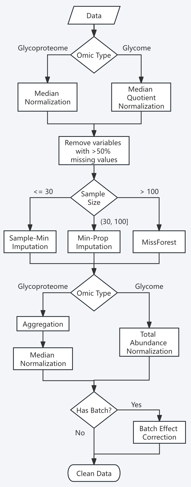

```{r, include = FALSE}
knitr::opts_chunk$set(
  collapse = TRUE,
  comment = "#>"
)
```

## Welcome to the Wild World of Data Preprocessing! 🧬

Every omics data analysis journey begins with the same challenge: 
taming your raw data.
Think of it like preparing ingredients before cooking a gourmet meal – 
you need to wash,
chop,
and season everything just right.
In the glycomics and glycoproteomics world,
this means normalization,
missing value handling,
and batch effect correction.

Meet `glyclean` – your Swiss Army knife for glycoproteomics and glycomics data preprocessing! 
This package provides a comprehensive toolkit that takes the guesswork out of data cleaning,
with specialized methods designed specifically for the unique challenges of glycan analysis.

**Important Note:** This package is primarily designed for `glyexp::experiment()` objects.
If you're new to this data structure,
we highly recommend checking out [its introduction](https://glycoverse.github.io/glyexp/articles/glyexp.html) first.
We'll also be using the [glyread](https://github.com/glycoverse/glyread) package to load our data – 
it's the go-to tool in the `glycoverse` ecosystem.


```{r setup}
library(glyclean)
library(glyread)
library(glyexp)
```

## Meet Our Star Player: Real Glycoproteomics Data 🌟

Let's dive in with a real-world dataset that will showcase what `glyclean` can do.
We'll use `glyread::read_pglyco3_pglycoquant()` to load our data into a proper `glyexp::experiment()` object.

```{r}
exp <- read_pglyco3_pglycoquant(
  "glycopeptides.list",
  sample_info = "sample_info.csv",
  glycan_type = "N"
)
exp
```

Let's peek under the hood and see what we're working with:

```{r}
get_var_info(exp)
```

```{r}
get_sample_info(exp)
```

What we have here is a beautiful N-glycoproteomics dataset featuring 500 PSMs (Peptide Spectrum Matches) across 12 samples.
These samples come from 3 different batches and represent 4 distinct biological groups – 
a perfect playground for demonstrating preprocessing techniques!

## The Magic Wand: One Function to Rule Them All ✨

### Meet `auto_clean()` – Your Preprocessing Superhero

Ready for some magic? 
Watch this:

```{r}
clean_exp <- auto_clean(exp)
```

**That's it!** 
Your data is now preprocessed and ready for analysis! 
🎉

### But Wait, What Just Happened? The Science Behind the Magic

`auto_clean()` isn't actually magic (sorry to disappoint) – 
it's a carefully designed intelligent pipeline that:

- **Analyzes your data**: Checks experiment type, sample size, and metadata
- **Selects optimal methods**: Chooses the best preprocessing strategy for your specific dataset
- **Executes the pipeline**: Runs everything in the optimal order

Here's the complete workflow (and yes,
it's impressively comprehensive):

```{r out.width = "40%", fig.align = "center", echo = FALSE}

```

## The Pipeline Approach: Chaining Operations Like a Pro 🔗

Before we dive into individual steps,
let's talk about a powerful R technique: **piping**! 
You can use either the native pipe operator `|>` (R ≥ 4.1.0) 
or the magrittr pipe `%>%` to chain preprocessing operations together.
This makes your code more readable and your workflow more elegant.

Here's how `auto_clean()` works under the hood for our glycoproteomics data,
written as a manual pipeline:

```{r eval=FALSE}
# The complete glycoproteomics preprocessing pipeline
# This is essentially what auto_clean() does automatically!
cleaned_exp <- exp |>
  normalize_median() |>             # Step 1: Initial normalization
  remove_rare(prop = 0.5) |>        # Step 2: Remove variables with >50% missing
  impute_sample_min() |>            # Step 3: Impute missing values (for small datasets)
  aggregate(to_level = "gfs") |>    # Step 4: Aggregate to glycoform level
  normalize_median() |>             # Step 5: Re-normalize after aggregation
  correct_batch_effect()            # Step 6: Correct batch effects (if batch column exists)
```

**Why use pipes?**

- **Cleaner code**: No need for intermediate variables
- **Logical flow**: Operations read left-to-right, top-to-bottom
- **Fewer errors**: Less chance of mixing up variable names
- **Easy experimentation**: Simply comment out or modify steps

**Pro Tips for Pipeline Usage:**

- Use `|>` for new R versions (≥ 4.1.0) or `%>%` for older versions
- Break long pipelines across multiple lines for readability
- Comment each step to document your reasoning
- Save intermediate results when debugging: `intermediate_result <- exp |> step1() |> step2()`

## Taking the Scenic Route: Step-by-Step Preprocessing 🚶‍♀️

While `auto_clean()` is fantastic for getting started,
you'll eventually want more control over your preprocessing pipeline.
Let's explore each step individually – 
think of it as learning to cook rather than just ordering takeout!

### Step 1: Normalization – Getting Everyone on the Same Page 📏

Imagine you're comparing heights of people measured in different units – 
some in feet,
some in meters,
some in furlongs (okay,
maybe not furlongs).
Normalization does the same thing for your omics data,
bringing all intensities to a comparable scale.

**What `auto_clean()` does:**

- **Glycoproteomics data**: Median normalization
- **Glycomics data**: Median quotient normalization followed by total area normalization

**Available normalization methods in `glyclean`:**

| Function | Description | Best For |
|----------|-------------|----------|
| `normalize_median()` | Median-based normalization | General use, robust to outliers |
| `normalize_median_abs()` | Median absolute deviation | When you need extra robustness |
| `normalize_median_quotient()` | Median quotient method | Compositional data |
| `normalize_quantile()` | Quantile normalization | When you want identical distributions |
| `normalize_total_area()` | Total area normalization | Relative abundance data |
| `normalize_rlr()` | Robust linear regression | Complex batch designs |
| `normalize_rlrma()` | Robust linear regression with median adjustment | Complex batch designs |
| `normalize_rlrmacyc()` | Robust linear regression with median adjustment and cyclic smoothing | Complex batch designs |
| `normalize_loessf()` | LOESS with feature smoothing | Non-linear trends |
| `normalize_loesscyc()` | LOESS with cyclic smoothing | Cyclic data |
| `normalize_vsn()` | Variance stabilizing normalization | Heteroscedastic data |

**Pro Tips:** 
- Notice the `by` parameter in many functions? This allows stratified normalization within groups – super useful when you have distinct experimental conditions!
- **Maximum flexibility**: The `by` parameter accepts both column names from your sample metadata and direct vectors! This gives you complete control over grouping, even for custom groupings that aren't stored in your experiment object.

```{r eval=FALSE}
# Example: Using by parameter with a custom vector
# Normalize within custom groups (e.g., based on some external criteria)
custom_groups <- c("A", "A", "B", "B", "C", "C", "A", "A", "B", "B", "C", "C")
normalized_exp <- normalize_median(exp, by = custom_groups)
```

Here we do the median normalization manually:

```{r}
normed_exp <- normalize_median(exp)
```

### Step 2: Variable Filtering – Saying Goodbye to the Unreliable 🧹

Some variables are like that friend who never shows up to plans – 
they're missing most of the time and aren't very helpful.
In omics data,
variables with too many missing values are often more noise than signal.

**What `auto_clean()` does:**
Removes variables with >50% missing values

**Available variable filtering functions in `glyclean`:**

| Function | Description | Best For |
|----------|-------------|----------|
| `remove_rare()` | Remove variables with too many missing values | General use |
| `remove_low_var()` | Remove variables with low variance | General use |
| `remove_low_cv()` | Remove variables with low coefficient of variation | General use |
| `remove_constant()` | Remove constant variables | General use |
| `remove_low_expr()` | Remove variables with low expression | General use |

**Manual approach (do it differently):**

```{r}
filtered_exp <- remove_rare(normed_exp, n = 0, by = "group", strict = FALSE)
```

This code translates to: 
"Keep any variable that has complete data in at least one biological group."
Perfect for maximizing the number of glycopeptides retained!

### Step 3: Imputation – Filling in the Blanks Intelligently 🔮

Here's where things get scientifically interesting! 
Missing values in mass spectrometry aren't randomly distributed – 
they follow patterns based on the physics and chemistry of the measurement process.

**The Science:** Missing values are typically "Missing At Random" (MAR),
meaning they're related to the intensity of the signal.
Low-abundance ions are more likely to be missed,
either due to poor ionization efficiency or because they fall below the detection threshold.

**What `auto_clean()` does (intelligently based on sample size):**

- **Small studies (≤30 samples)**: Sample minimum imputation (ultra-robust)
- **Medium studies (30-100 samples)**: Minimum probability imputation (statistically principled)
- **Large studies (>100 samples)**: MissForest imputation (machine learning power)

**Your imputation toolkit:**

| Function | Method | Best For |
|----------|--------|----------|
| `impute_zero()` | Replace with zeros | Quick and simple |
| `impute_sample_min()` | Sample minimum values | Small datasets |
| `impute_half_sample_min()` | Half of sample minimum | Conservative approach |
| `impute_min_prob()` | Probabilistic minimum | Medium datasets |
| `impute_miss_forest()` | Random Forest ML | Large datasets |
| `impute_bpca()` | Bayesian PCA | High correlation structure |
| `impute_ppca()` | Probabilistic PCA | Linear relationships |
| `impute_sw_knn()` | K-nearest neighbors (Sample-wise) | Local similarity patterns |
| `impute_fw_knn()` | K-nearest neighbors (Feature-wise) | Local similarity patterns |
| `impute_svd()` | Singular value decomposition | High correlation structure |

For demonstration,
let's use the simple zero imputation:

```{r}
imputed_exp <- impute_zero(filtered_exp)
```

### Step 4: Aggregation – From Peptides to Glycoforms 🔄

Here's where glycoproteomics gets uniquely challenging! 
Search engines typically report results at the PSM or peptide level,
but what we really care about are **glycoforms** – 
the specific glycan structures attached to specific protein sites.

**The Problem:** One glycoform can appear multiple times in your data due to:

- Different charge states
- Post-translational modifications
- Missed protease cleavages
- Different peptide sequences covering the same site

**The Solution:** Intelligent aggregation!

**Aggregation levels available:**

- **"gps"**: Glycopeptides with structures (most detailed)
- **"gp"**: Glycopeptides with compositions
- **"gfs"**: Glycoforms with structures (recommended default)
- **"gf"**: Glycoforms with compositions (most condensed)

**What `auto_clean()` does:**
If `glycan_structure` column exists,
aggregate to "gfs" level.
Otherwise, aggregate to "gf" level.

```{r}
aggregated_exp <- aggregate(imputed_exp, to_level = "gf")
```

**Pro move:** Re-normalize after aggregation to account for the new intensity distributions:

```{r}
aggregated_exp2 <- normalize_median(aggregated_exp)
```

### Step 5: Batch Effect Correction – Harmonizing Your Orchestra 🎼

Batch effects are the "different violinists playing the same piece" problem of omics data.
Even when following identical protocols,
subtle differences in instruments,
reagents,
or environmental conditions can introduce systematic bias.

**The Good News:** If your experimental design is well-controlled (conditions distributed across batches),
batch effect correction can work wonders!

**What `auto_clean()` does:**
Automatically detects and corrects batch effects when it finds a "batch" column in your sample metadata,
and batch effects are detected for more than 10% variables.

```{r}
# To detect batch effects:
p_values <- detect_batch_effect(aggregated_exp2)
p_values[1:5]
```

Here we do not have batch effects,
but we will correct it anyway for demonstration.

```{r}
# To correct batch effects:
corrected_exp <- correct_batch_effect(aggregated_exp2)
```

### Step 6: Protein Expression Adjustment – Separating Signal from Noise 🎯

Here's a fascinating biological puzzle: 
when you measure a glycopeptide's intensity,
you're actually seeing two stories at once!

**The Dual Nature Problem:** Every glycopeptide intensity is a tale of two factors:

- **The protein story**: How much of the substrate protein is present
- **The glycosylation story**: How actively that protein is being glycosylated

It's like trying to understand applause volume – 
is the audience bigger,
or are they just more enthusiastic?

**The Solution:** If you're specifically interested in glycosylation changes (not protein abundance changes),
you need to mathematically "subtract out" the protein expression component.
Think of it as noise cancellation for biology!

```R
# We don't run the code here because we don't have the protein expression matrix.
adjusted_exp <- adjust_protein(inferred_exp, pro_expr_mat)
```

**Important Prerequisites:**

- Your protein expression matrix must have the same samples as your glycopeptide data
- The protein expression matrix should be properly preprocessed (good news: you can use `glyclean` functions for this too!)
- Sample matching needs to be perfect – no mixing apples with oranges!

**Pro Tip:** 
Most `glyclean` functions happily accept plain matrices as input,
so you can preprocess your protein expression data using the same toolkit.
Consistency is key!

**What `auto_clean()` does:** 
Nothing again! 
This step requires external protein expression data,
which `auto_clean()` can't magically conjure up.
You're the chef here – `auto_clean()` just provides the ingredients!

### 🎉 Mission Accomplished!

Congratulations! 
You now have beautifully preprocessed,
analysis-ready glycoproteomics data.
Your data has been normalized,
filtered,
imputed,
aggregated,
and batch-corrected – 
it's ready to reveal its biological secrets!

## Advanced Usage: Beyond `glyexp::experiment()` Objects 🔧

While this vignette focuses on `glyexp::experiment()` objects,
`glyclean` is designed to be flexible and accommodating to different workflows and data formats.

### Working with Plain Matrices

Most `glyclean` functions also support plain matrices as input! 
This means you can use the package's powerful preprocessing capabilities even if you're working with traditional data formats.
The functions intelligently detect your input type and handle it appropriately.

```{r eval=FALSE}
# Example: Using glyclean with a plain matrix
my_matrix <- matrix(rnorm(100), nrow = 10)
normalized_matrix <- normalize_median(my_matrix)
imputed_matrix <- impute_sample_min(normalized_matrix)
```

### Flexible Grouping with Custom Vectors

Many functions in `glyclean` accept a `by` parameter for stratified processing.
This parameter offers maximum flexibility – 
it accepts both column names from your sample metadata and direct vectors!

```{r eval=FALSE}
# Using column names (standard approach)
normalized_exp <- normalize_median(exp, by = "group")

# Using custom vectors (advanced approach)
custom_groups <- c("A", "A", "B", "B", "C", "C", "A", "A", "B", "B", "C", "C")
normalized_exp <- normalize_median(exp, by = custom_groups)

# This also works with matrices
normalized_matrix <- normalize_median(my_matrix, by = custom_groups)
```

This gives you complete control over grouping,
even for custom groupings that aren't stored in your experiment object.
Perfect for complex experimental designs or external grouping criteria!

## What's Next?

With your clean data in hand,
you're ready to dive into the exciting world of glyco-omics analysis:

- **Differential analysis**: Find glycans that change between conditions
- **Pathway analysis**: Understand biological processes
- **Machine learning**: Build predictive models
- **Visualization**: Create stunning plots that tell your data's story

The `glycoverse` ecosystem has tools for all of these and more!
